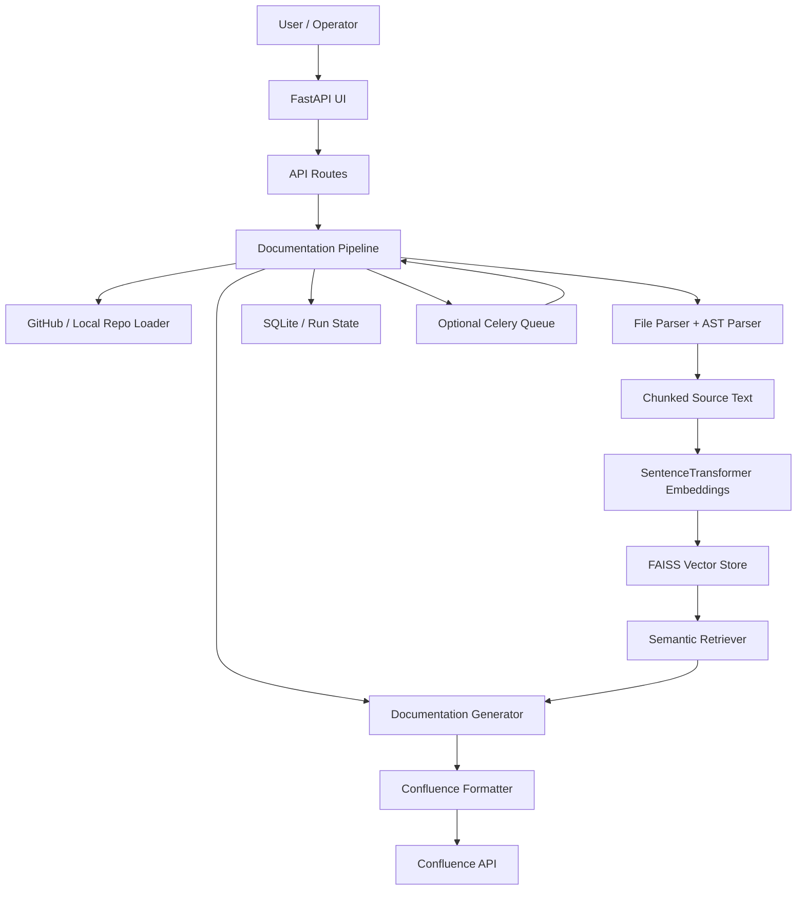

# AI Codebase Documentation System

AI Codebase Documentation System is a FastAPI-based application that ingests a source repository, indexes its code, generates documentation from the discovered structure, and can publish the result to Confluence.

It is designed for engineering teams that want a repeatable way to turn a codebase into readable project documentation without writing everything by hand.

## What It Does

- Clones or opens a Git repository.
- Parses supported source files and extracts symbols, modules, and dependencies.
- Builds embeddings and a vector index for semantic retrieval.
- Generates documentation content from repository evidence.
- Renders a browser UI for running the workflow.
- Publishes ready-to-use pages to Confluence when configured.

## Main Features

- Web UI for kicking off ingestion and documentation generation.
- REST API for health checks, ingestion, and documentation generation.
- Incremental indexing so only changed files are reprocessed.
- Semantic retrieval over the indexed repository.
- Optional Confluence publishing.
- Jinja-based HTML templating for the landing page.

## Tech Stack

- Python 3.10+
- FastAPI
- Jinja2
- Celery
- Redis
- GitPython
- Sentence Transformers
- FAISS
- Transformers and Torch
- Pydantic

## Requirements

### Required

- Python 3.10 or newer.
- A virtual environment.
- The packages in [requirements.txt](requirements.txt).
- Git access to the repository you want to document.

### Required for Background Jobs

- Redis running locally or at the broker URL configured in `.env`.
- Celery worker if you want asynchronous task execution.

### Required for Confluence Publishing

- `CONFLUENCE_BASE_URL`
- `CONFLUENCE_EMAIL`
- `CONFLUENCE_API_TOKEN`
- `CONFLUENCE_SPACE_KEY`

### Optional Configuration

- `NVIDIA_API_KEY` if you plan to use the NVIDIA-backed describer.
- `CELERY_BROKER_URL`
- `CELERY_RESULT_BACKEND`
- `EMBEDDING_MODEL_NAME`
- `LLM_MODEL_NAME`

## Project Structure

- [main.py](main.py) starts the application with Uvicorn.
- [api/server.py](api/server.py) builds the FastAPI app.
- [api/routes.py](api/routes.py) contains the UI and API endpoints.
- [workers/pipeline.py](workers/pipeline.py) runs the documentation pipeline.
- [workers/celery_worker.py](workers/celery_worker.py) defines the Celery task entry point.
- [ingestion/](ingestion/) contains repository and file parsing logic.
- [rag/](rag/) contains embeddings, retrieval, and vector store code.
- [llm/](llm/) contains prompt templates and model loading.
- [integrations/](integrations/) contains Confluence integration code.
- [compiler/](compiler/) contains the Confluence document formatter and schema.

## How To Run

### 1. Create and activate a virtual environment

```bash
cd "/Users/saillesh/Desktop/Documentation AI/ai-codebase-doc-system"
python3 -m venv .venv
source .venv/bin/activate
```

### 2. Install dependencies

```bash
pip install -r requirements.txt
```

### 3. Configure environment variables

Create a `.env` file in the project root if you need Confluence or Celery settings.

Example:

```env
CONFLUENCE_BASE_URL=https://your-domain.atlassian.net
CONFLUENCE_EMAIL=your.email@example.com
CONFLUENCE_API_TOKEN=your-api-token
CONFLUENCE_SPACE_KEY=DOC

CELERY_BROKER_URL=redis://localhost:6379/0
CELERY_RESULT_BACKEND=redis://localhost:6379/1
```

### 4. Start the web app

```bash
python main.py
```

Or run Uvicorn directly:

```bash
uvicorn main:app --reload --host 0.0.0.0 --port 8000
```

Then open:

```text
http://localhost:8000/
```

### 5. Optional: start Redis and Celery

If you want queue-based execution or repository watching, start Redis first, then launch the worker:

```bash
celery -A workers.celery_worker.celery_app worker --loglevel=info
```

### 6. Optional: watch a repository for changes

```bash
python workers/repo_watcher.py --repo-url /path/to/repo --branch main
```

## API Endpoints

- `GET /` - browser UI.
- `GET /api/health` - basic health check.
- `POST /api/ingest` - ingest a repository and summarize it.
- `POST /api/generate` - run the full pipeline and return generated documentation data.
- `POST /api/confluence-page` - generate a ready-to-publish Confluence page, and publish it when requested.

Example request:

```bash
curl -X POST http://localhost:8000/api/ingest \
	-H "Content-Type: application/json" \
	-d '{"repo_url":"/path/to/repo","branch":"main"}'
```

## System Design

The system is organized as a layered pipeline:

1. **Presentation layer**: the FastAPI app serves the browser UI and API endpoints.
2. **Pipeline layer**: `DocumentationPipeline` orchestrates ingestion, indexing, retrieval, and generation.
3. **Ingestion layer**: repository loading, file parsing, AST symbol extraction, and incremental change detection.
4. **Index and retrieval layer**: embeddings and FAISS store the code chunks; the retriever finds evidence for documentation.
5. **Generation layer**: the documentation generator assembles structured documentation from repository evidence.
6. **Publishing layer**: Confluence formatting and publishing create pages in the configured space.
7. **State layer**: SQLite and workspace indexes store prior runs, file hashes, and chunk identifiers.

### Architecture Diagram



### Data Flow

1. The user submits a repository URL or local path.
2. The pipeline loads the repository and parses supported files.
3. Changed files are chunked and embedded.
4. The vector store is updated incrementally.
5. Retrieval adds evidence for documentation generation.
6. The generated payload is converted into Confluence storage format.
7. If publishing is enabled, the page tree is sent to Confluence.

## Defaults And Configuration

The application reads settings from `config.py` and `.env`.

Important defaults:

- Embedding model: `sentence-transformers/all-MiniLM-L6-v2`
- Local LLM model: `mistralai/Mistral-7B-Instruct-v0.3`
- Vector store: `faiss`
- Confluence root page title: `AI Generated Codebase Docs`
- Celery broker: `redis://localhost:6379/0`

## Testing

Run the test suite with:

```bash
pytest
```

## Notes

- The public home page is built from a Jinja template in [api/templates/home.html](api/templates/home.html).
- Publishing to Confluence is optional, but the base URL and credentials must be configured before enabling it.
- Large repositories may need more time for the first indexing pass.

## License

No license file is currently included in the repository. Add one before publishing this project publicly.